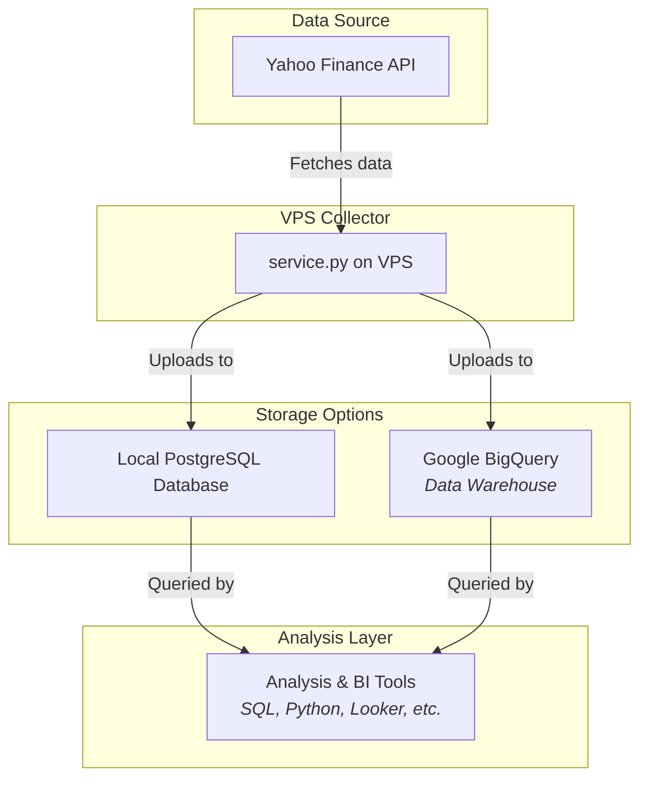

# Data Pipeline Architecture

This document outlines the data pipeline for collecting, storing, and analyzing financial data using this project.

## Pipeline Diagram

The architecture uses a small VPS for data collection with optional cloud/local storage for analysis.



## Workflow Steps

1.  **Collect (on VPS):**
    *   The `service.py` script runs on a schedule (e.g., via cron) on your VPS.
    *   It fetches the latest market data from the Yahoo Finance API.
    *   It performs optional data quality checks to ensure integrity.
    *   Data is temporarily stored on the VPS's local disk as CSV files.

2.  **Store (Local or Cloud):**
    *   The script uploads the processed data to one or both of the following destinations:
        *   **Local PostgreSQL:** Data is stored in a local PostgreSQL database on the VPS or nearby server. Good for small to medium datasets with limited query needs.
        *   **Google BigQuery:** Data is loaded into structured tables in the cloud. This serves as a high-performance "data warehouse," optimized for fast and complex analytical SQL queries.

3.  **Analyze (from anywhere):**
    *   **With BigQuery:** Connect powerful tools for analysis without impacting your VPS. Run complex SQL queries using the BigQuery web UI or any connected SQL client. Connect BI tools like Looker, Tableau, or Google Data Studio to create dashboards.
    *   **With Local PostgreSQL:** Query directly from your VPS or any machine with network access to your PostgreSQL database.

## Key Benefits

*   **Flexibility:** Choose between local PostgreSQL (simple, self-contained) or BigQuery (scalable, powerful) based on your needs.
*   **Performance (BigQuery):** Leverages Google BigQuery's distributed engine to run queries over massive datasets far faster than a local database.
*   **Decoupling:** Your collection service on the VPS is decoupled from your analysis workload.
*   **Cost-Effectiveness:** Only pay for cloud resources you actually use.
*   **Resilience (BigQuery):** Cloud storage solutions are highly durable and resilient.

## How to Enable This Pipeline

Configure the relevant settings in your `.env` file:

**For Local PostgreSQL:**
```bash
ENABLE_LOCAL_DB=true
DB_NAME=your_database
DB_USER=your_username
DB_PASSWORD=your_password
DB_HOST=localhost
DB_PORT=5432
```

**For Google BigQuery:**
```bash
ENABLE_BIGQUERY=true
daily_datset_bq=your-project.dataset.daily_table
intraday_dataset_bq=your-project.dataset.intraday_table
GOOGLE_APPLICATION_CREDENTIALS=/path/to/service-account-key.json
```

**For Both:**
```bash
ENABLE_LOCAL_DB=true
ENABLE_BIGQUERY=true
# ... configure both sets of credentials
```

## Weekend Automation

The pipeline runs automatically via cron job on weekends:

1. Make the script executable:
   ```bash
   chmod +x /home/farq/projects/yfin_data_collect/run_weekend_job.sh
   ```

2. Add to crontab (runs every Saturday at 2:00 AM):
   ```bash
   crontab -e
   # Add:
   0 2 * * 6 /home/farq/projects/yfin_data_collect/run_weekend_job.sh >> /home/farq/projects/yfin_data_collect/logs/cron_output.log 2>&1
   ```

See `CRON_SETUP.md` for complete setup instructions.
